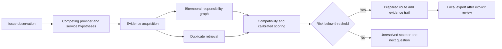

# WhoFixesThis

WhoFixesThis is an offline-first research prototype for evidence-based civic service routing. It takes an issue description, location context, observation time, uncertainty, and an optional asset identifier. It then constructs competing provider and service hypotheses, searches dated evidence, checks likely duplicates, and either selects a supported route or abstains.

The central task is administrative responsibility. Image and text cues are inputs to the search process, not ownership labels.

The public demo uses fictional jurisdictions and frozen fixtures. It is not government guidance and it never submits a report.

## What is included

- A live React and TypeScript workbench with an offline MapLibre view
- A deterministic FastAPI service with typed Pydantic contracts
- A bitemporal responsibility graph with valid-time and transaction-time queries
- Evidence-directed provider and service scoring with calibrated abstention
- Duplicate candidates, counterfactual explanations, and escalation paths
- FixRouteBench with 50 deterministic cases across ten hard-case families
- CLI workflows for validation, resolution, benchmarking, and reproduction
- Unit, temporal, safety, API, integration, and rendered application tests
- Source governance, model and benchmark cards, annotation guidance, and paper artifacts

## Why routing needs temporal evidence

A pin inside a city boundary does not prove that the city maintains the asset. A road can belong to a regional authority. A transit entrance can intersect a city sidewalk. A contractor can hold a temporary obligation during active works. A service code can change while the underlying responsibility stays the same.

WhoFixesThis keeps four concepts separate:

1. Operational responsibility supported by dated evidence
2. The agency selected on a historical request
3. The agency that closed or transferred that request
4. The organization that owns the data system

Only the first concept is the target decision. Historical agency fields remain weak evidence until they are independently corrected.

## System shape



Every selected route contains supporting evidence, contradicting evidence, source dates, a decision timestamp, and a counterfactual fact that could change the decision.

## Quick start

### Web workbench

```bash
npm install
npm run dev
```

Open `http://localhost:3000`.

The interface runs against frozen fictional records. An uploaded image stays in the browser session. Export creates a local JSON file and does not contact a provider.

### Python package and API

```bash
python -m venv .venv
python -m pip install -e ".[dev]"
uvicorn whofixesthis.api:app --reload
```

The API documentation is available at `http://127.0.0.1:8000/docs`.

Core endpoints:

| Method | Path | Purpose |
| --- | --- | --- |
| `GET` | `/health` | Fixture mode and checksum |
| `GET` | `/v1/cases` | Frozen benchmark case index |
| `POST` | `/v1/resolve` | Resolve a case or typed observation |
| `GET` | `/v1/benchmark` | Run the deterministic smoke benchmark |
| `POST` | `/v1/reports/prepare` | Build a local report preview |
| `POST` | `/v1/reports/approve` | Approve local export only |

There is no submission endpoint.

### CLI

```bash
whofixesthis ingest --jurisdiction configs/metro.yaml
whofixesthis benchmark --config configs/smoke.yaml
whofixesthis resolve --case frb-001
whofixesthis reproduce --manifest examples/manifests/smoke.json
```

`ingest` validates frozen source configuration in the current release. It does not fetch or mutate live systems.

## FixRouteBench

FixRouteBench contains 50 deterministic episodes across two adjacent fictional municipalities and one regional provider. The cases cover:

- Regional road versus city road
- Parallel roads and divided ownership
- Transit property versus sidewalk
- Utility attachment versus public lighting
- Public sidewalk versus private frontage
- Contractor obligations during active works
- Exact boundary ambiguity
- Same-asset duplicate reports
- Time-versioned service codes
- Historical wrong-provider fields

Each episode records initially visible evidence, action-revealed evidence, acquisition cost, event time, decision time, candidate hypotheses, a corrected target, duplicate state, escalation path, and minimum sufficient evidence.

Run the benchmark:

```bash
python -m whofixesthis benchmark --config configs/smoke.yaml
```

The resulting metrics are fixture smoke checks. They do not measure real-world performance and must not be reported as civic deployment results.

The committed 0.1 fixture run resolves all expected contract labels, abstains on 12 of 50 open-set episodes, and reaches 0.76 selective coverage. These are generated acceptance checks, not model evaluation results.

## Repository map

```text
app/                         Live workbench
lib/                         Browser-side deterministic router
src/whofixesthis/            Python models, graph, resolver, API, CLI
configs/                     Frozen experiment and source contracts
data/fixtures/               FixRouteBench JSONL
docs/                        Architecture, governance, cards, annotation guide
paper/                       Claims, analysis plan, tables, and checklist
scripts/                     Deterministic fixture generation
tests/                       Python and rendered application tests
```

## Bitemporal contract

Responsibility edges use two half-open intervals:

- `valid_time` answers when the claim applied in the world
- `transaction_time` answers when the system knew the claim

An edge is visible only when the event time is inside its valid interval and the decision time is inside its transaction interval. This prevents a later service change or ticket outcome from leaking into an earlier decision snapshot.

## Decision policy

The resolver:

1. Generates provider and service hypotheses
2. Scores initially visible evidence
3. Reveals frozen ownership, service, permit, and history records
4. Applies event-time and decision-time visibility checks
5. Penalizes broad location uncertainty
6. Requires both a confidence threshold and a score margin
7. Returns an unresolved state when evidence is insufficient

Open-set outcomes include private responsibility, unknown utility ownership, shared responsibility, and no supported public route.

## Safety and privacy

- No autonomous report submission, email, or outreach
- No live government mutation in code or tests
- No hidden contact or reporting data
- Explicit local-export approval after preview
- User-controlled location precision
- Uploaded media is not retained by the web demo
- Historical routing fields are never promoted to ground truth by default
- Utility topology is not exposed
- Source text and attachment content are treated as untrusted

See [data governance](docs/data_governance.md) and the [threat model](docs/threat_model.md) for the operational contract.

## Reproducibility

The benchmark records a fixture checksum, deterministic seed, resolver thresholds, predictions, and summary metrics. Reproduction fails if the fixture checksum differs from the manifest.

The full research package includes:

- [Source registry](docs/source_registry.md)
- [Architecture](docs/architecture.md)
- [Model card](docs/model_card.md)
- [Benchmark card](docs/benchmark_card.md)
- [Annotation manual](docs/annotation_manual.md)
- [Responsibility ontology](docs/responsibility_ontology.md)
- [Claims ledger](paper/claims/claims_ledger.md)
- [Analysis plan](paper/analysis_plan.md)
- [Reproducibility checklist](paper/reproducibility_checklist.md)

## Current limitations

The default release uses fictional fixtures rather than authoritative routing labels from a civic partner. It does not perform OCR, image redaction, live geocoding, live Open311 discovery, or external submission. The interfaces and contracts are present so those components can be evaluated without changing the responsibility semantics.

Do not claim final resolution improvement without prospective outcomes or a carefully controlled historical study. Do not treat the deterministic fixture score as evidence for deployment.

## Development

```bash
npm test
python -m pytest
```

Tests are deterministic after dependencies are installed. They do not call external APIs.

## License

Code is released under the MIT License. The fictional benchmark fixtures are released under CC0-1.0.

## Citation

Use the metadata in [`CITATION.cff`](CITATION.cff). Please cite a released version and record the fixture checksum used in any experiment.
